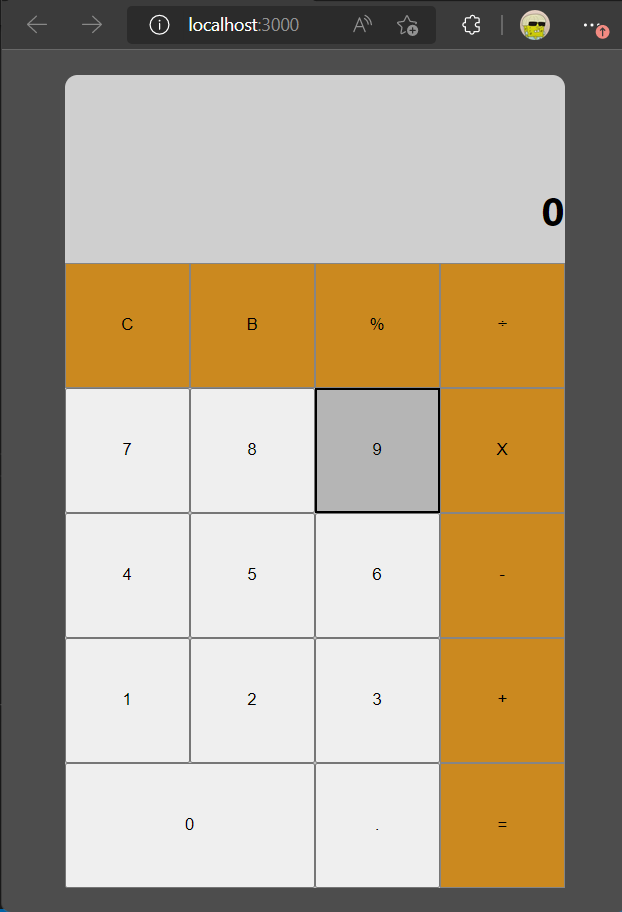
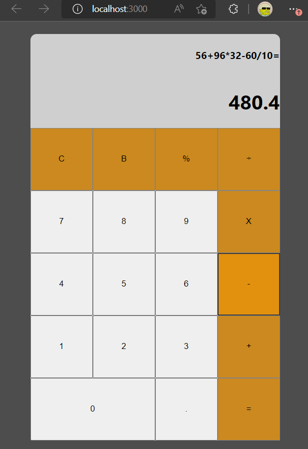

## Hosted Link -- https://react-calculator-c2e24.web.app

# Video Link

[](https://www.youtube.com/watch?v=MNG0lUzpMV8)

### Description

Simple Calculator

## Folder Structure

```
calculator
├─ .gitignore
├─ package-lock.json
├─ package.json
├─ public
│  ├─ favicon.ico
│  ├─ index.html
│  ├─ logo192.png
│  ├─ logo512.png
│  ├─ manifest.json
│  └─ robots.txt
├─ README.md
└─ src
   ├─ App.js
   ├─ component
   │  ├─ AllCalButtons.js
   │  ├─ Display.js
   │  └─ MainCal.js
   ├─ index.css
   └─ index.js

```

## Some ScreenShots of Project



